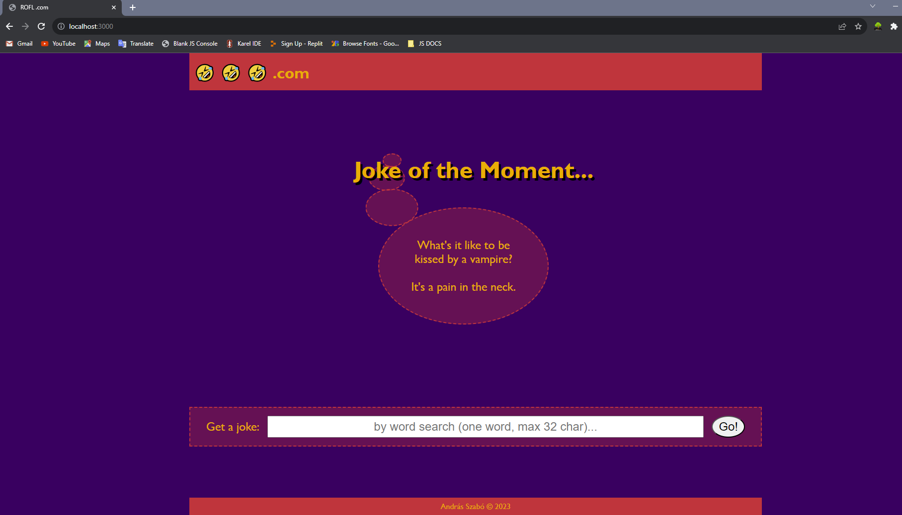

# Joke-generator site codenamed "ROFL.com"
My Capstone Project #4 for Udemy web-development bootcamp.
## Project Description
Target:\
Use a public API and integrate it into a web application.\
\

## Big Thanks
to JokeAPI @ https://sv443.net/jokeapi/v2/   \
by Sven Fehler @ https://github.com/Sv443
